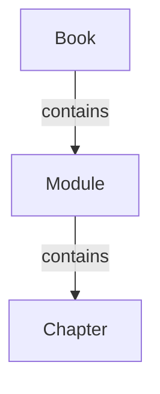

# Data Model: Textbook Structure

**Date**: 2025-12-07
**Status**: Completed

This document defines the core data entities that structure the textbook content, as extracted from the feature specification.

## Entity Relationship Diagram

## Entity Definitions

### 1. Book

The top-level entity representing the entire textbook.

-   **Fields**:
    -   `title`: The main title of the book.
    -   `subtitle`: The subtitle of the book.
    -   `overview`: A high-level description of the book's content and goals.
    -   `modules`: A collection of `Module` entities.
-   **Validation Rules**:
    -   Must have a `title` and `subtitle`.
    -   Must contain at least one `Module`.

### 2. Module

A logical grouping of chapters, representing a major section of the book.

-   **Fields**:
    -   `title`: The title of the module (e.g., "Robotic Nervous System (ROS 2)").
    -   `chapters`: A collection of `Chapter` entities.
-   **Validation Rules**:
    -   Must have a `title`.
    -   Must contain at least one `Chapter`.

### 3. Chapter

A specific topic within a module, representing a single chapter in the book.

-   **Fields**:
    -   `title`: The title of the chapter.
    -   `learning_objectives`: A list of what the reader will learn.
    -   `content`: The main body of the chapter in Markdown/MDX format.
    -   `exercises`: Hands-on exercises for the reader.
-   **Validation Rules**:
    -   Must have a `title` that is unique within its parent `Module`.
    -   Must have `learning_objectives`.
