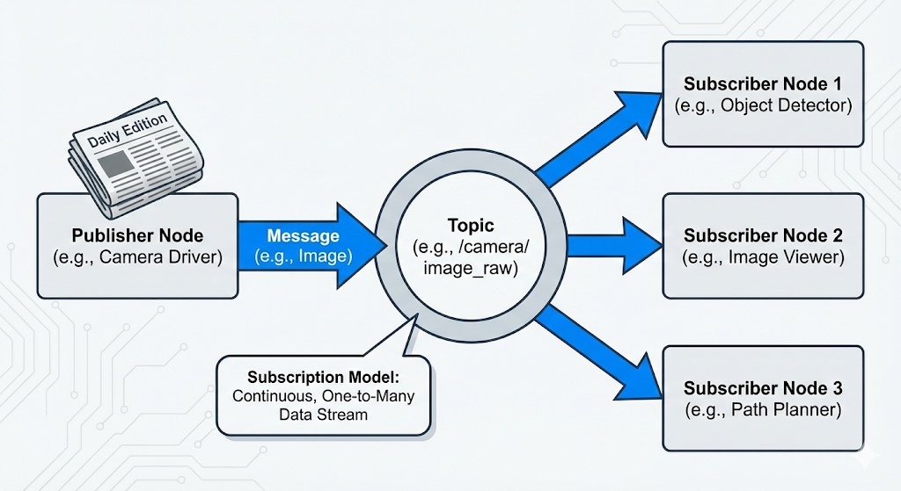
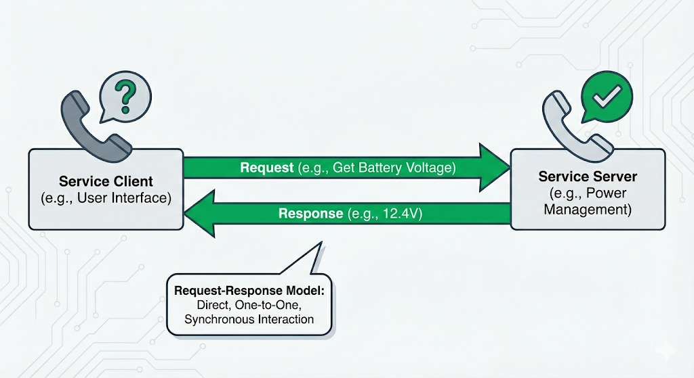
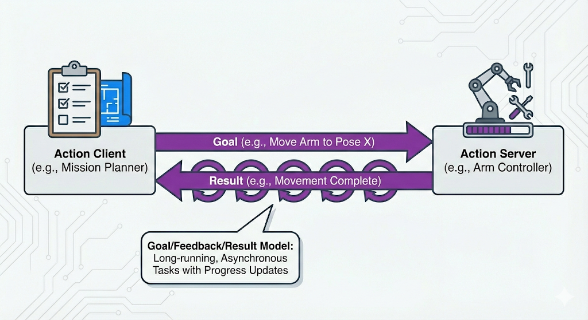
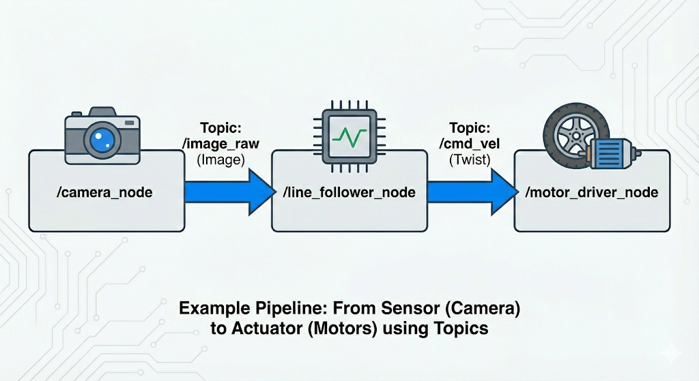

# Chapter 5: ROS 2 Communication Primitives

## Chapter Overview

In the previous chapter, we explored the high-level architecture of ROS 2, viewing it as the nervous system of our robot. We learned about nodes as the fundamental building blocks of the computational graph. But how do these blocks actually talk to each other? How does a sensor node tell a control node that an obstacle is near? How does a user interface tell the robot's navigation system where to go?

This is accomplished through a set of communication patterns known as the **ROS 2 communication primitives**. These primitives are the specific, well-defined "language" that ROS 2 nodes use to interact. Mastering them is the key to designing and building complex, robust robotic systems.

In this chapter, we will dive deep into the three core communication primitives:
-   **Topics**: For continuous, one-to-many streams of data.
-   **Services**: For one-to-one, request-response interactions.
-   **Actions**: For long-running, asynchronous tasks that require feedback.

Our learning objectives are to:
-   Build a strong conceptual model of the publish/subscribe, request/response, and goal/feedback/result communication patterns.
-   Understand the specific use cases for which each primitive is best suited.
-   Develop the critical skill of choosing the right communication tool for any given robotics task.
-   See how these primitives work together to orchestrate the overall behavior of a robot.

By the end of this chapter, you will be able to look at a complex robotics task and confidently sketch out the nodes and the communication channels required to make it happen.

## Recap: The ROS 2 Computational Graph

As we learned in Chapter 4, the entire software system of a ROS 2 robot is organized as a **computational graph**. The graph is a network of independent programs called **nodes**.

-   **Nodes**: Each node has a single, well-defined purpose (e.g., controlling the camera, detecting obstacles, planning a path).
-   **Graph**: The collection of all these nodes and the connections between them form the complete software system for the robot.

The key idea is to build complexity by composing simple, reusable components. Now, let's explore the "connections" between the nodes: the communication primitives.

## Topics: The Continuous Data Stream (Publish/Subscribe)

The most common and fundamental communication primitive in ROS 2 is the **topic**. Topics are used for continuous, asynchronous streams of data.

-   **The Pattern**: Publish/Subscribe (or "Pub/Sub").
-   **The Analogy**: A newspaper subscription.

Imagine a newspaper company. It **publishes** a new edition every day. It doesn't know who its readers are, nor does it send the paper to any specific person. It just prints the paper and puts it on the stands.

Now, imagine the readers. They can **subscribe** to the newspaper. They don't need to know who wrote the articles or where the printing press is. They just know they want to receive the newspaper every day. Any number of people can subscribe, and they all get the same information.

This is exactly how ROS 2 topics work.

-   A **Publisher** node writes data (a `message`) to a named topic (e.g., `/robot_state` or `/camera_images`). It does not know which nodes, if any, are listening.
-   A **Subscriber** node expresses interest in a named topic. It receives messages from that topic without knowing which node sent them.
-   There can be many publishers and many subscribers on the same topic.

*In a topic, a publisher sends a message to a named channel. Any number of subscribers can listen to that channel and receive a copy of the message.*

### When to Use Topics

Topics are the right choice when you have a continuous stream of data and you want a decoupled, one-to-many communication pattern.

-   **Good for**: Streaming sensor data (camera feeds, laser scans, IMU readings), broadcasting robot state (odometry, joint positions), or any other data that is generated periodically.
-   **Not good for**: A specific, one-time command or a request for data that requires a direct response. If you need a response, you should use a Service.

## Services: The Request-Response Interaction

While topics are great for continuous data, they don't work when you need to have a direct, two-way conversation. For that, ROS 2 provides **services**.

-   **The Pattern**: Request/Response (or "Client/Server").
-   **The Analogy**: A phone call.

When you make a phone call, you (the **client**) dial a specific number to reach one person (the **server**). You ask a question (the **request**), and you wait on the line until you get an answer (the **response**). The conversation is direct, one-to-one, and synchronous (you wait for the answer).

This is precisely how ROS 2 services work.

-   A **Service Server** node advertises a named service (e.g., `/get_battery_voltage`). It waits for an incoming request.
-   A **Service Client** node calls the service by name, sending a single request message. The client then blocks (waits) until the server has processed the request and sent back a single response message.

This is a tightly coupled, synchronous interaction.

*In a service, a client sends a request to a server, which processes it and returns a response directly to the client.*

### When to Use Services

Services are the right choice when you need a direct, one-to-one interaction where the client needs a confirmation or a piece of data back from the server.

-   **Good for**: Querying for a piece of data (e.g., "What is the robot's current pose?"), triggering a discrete action (e.g., "Take a picture now and save it to disk"), or changing the state of a node (e.g., "Switch to manual control mode").
-   **Not good for**: Continuous data streams (use a topic). Also not ideal for tasks that take a long time to complete, because the client will be blocked waiting for the response. If you have a long-running task, you should use an Action.

## Actions: For Long-Running Goals with Feedback

What if you need to request a task that takes a long time, like "navigate to the kitchen"? A service is not a good fit, because you don't want your client to be blocked for minutes waiting for a response. You also probably want to get updates on the task's progress and have the ability to cancel it. For this, ROS 2 provides its third and most complex primitive: **actions**.

-   **The Pattern**: Goal/Feedback/Result.
-   **The Analogy**: Ordering a custom project or a complex meal at a restaurant.

Imagine you order a custom piece of furniture.
1.  You give the specifications to the woodworker (the **goal**).
2.  The woodworker accepts the project and occasionally sends you pictures of their progress (the **feedback**).
3.  You can call at any time to cancel the order.
4.  When the project is finally complete, the woodworker delivers the finished piece (the **result**).

This is precisely how ROS 2 actions work.

-   An **Action Client** sends a goal to an **Action Server** (e.g., "move the arm to position X, Y, Z").
-   The **Action Server** receives the goal and can either accept or reject it. If it accepts, it starts working on the task.
-   While working, the server can publish a stream of **feedback** messages (e.g., the arm's current distance from the target).
-   The client can send a **cancel request** at any time.
-   When the task is complete, the server sends a single **result** message (e.g., "succeeded" or "failed").

This is an asynchronous, one-to-one interaction that is perfect for any task that isn't instantaneous.

*The complete lifecycle of an action, showing the initial goal, the stream of feedback, and the final result.*

### When to Use Actions

Actions are the right choice for any goal-oriented task that takes a significant amount of time to complete, especially if you need progress updates or the ability to cancel it.

-   **Good for**: Navigation ("go to GPS coordinate A"), manipulation ("pick up the red block"), complex sensor calibrations, or any multi-step process.
-   **Not good for**: Simple, quick requests (use a service) or continuous data streams (use a topic).

## Choosing the Right Tool: A Comparison

Choosing the correct communication primitive is a critical design skill in ROS 2. Using the wrong tool can lead to systems that are inefficient, unresponsive, or difficult to manage. The table below provides a quick reference.

| Characteristic      | Topics (Publish/Subscribe)      | Services (Request/Response)       | Actions (Goal/Feedback/Result)    |
| ------------------- | ------------------------------- | --------------------------------- | --------------------------------- |
| **Pattern**         | One-to-Many                     | One-to-One                        | One-to-One                        |
| **Synchronicity**   | Asynchronous (fire and forget)  | Synchronous (client waits)        | Asynchronous (non-blocking)       |
| **Relationship**    | Decoupled (anonymous)           | Tightly Coupled (direct call)     | Tightly Coupled (direct goal)     |
| **Use For**         | Continuous data streams (e.g., sensor data, robot state) | Quick, discrete tasks that require a response (e.g., query data, trigger event) | Long-running, complex tasks that require feedback and can be canceled (e.g., navigation, manipulation) |

**Rule of Thumb:**
-   If you have data that needs to be sent continuously to anyone who might be interested, use a **Topic**.
-   If you need to make a specific request to a specific node and get a response right away, use a **Service**.
-   If you need to assign a long-running task to a specific node and get progress updates along the way, use an **Action**.

## A Note on Interfaces: Message Definitions

We've discussed the *patterns* of communication (Topics, Services, Actions), but what about the *language*? How does a publisher node structure its data so a subscriber node can understand it?

This is handled by **interface definitions**. In ROS 2, the structure of the data sent over topics, services, and actions is defined in simple text files:
-   `.msg` files for Topics
-   `.srv` files for Services (which define the structure of both the request and the response)
-   `.action` files for Actions (which define the structure of the goal, feedback, and result)

Think of these interface definitions as the **data contract** or the shared language between nodes. For example, a `/robot_state` topic might use a message type called `RobotState.msg` that contains fields for `joint_positions`, `battery_level`, and `is_balancing`. Any node that wants to publish or subscribe to this topic must agree to use this exact structure.

This strong typing is a key feature of ROS 2. It prevents you from sending the wrong kind of data to a topic and ensures that all communication across the graph is consistent and predictable. While we won't get into the syntax of creating your own custom message files in this chapter, it's crucial to know that this underlying layer of data contracts is what makes robust communication possible.

## A Note on Naming and Composition

As you design more complex systems, the names you give to your nodes, topics, services, and actions become incredibly important. A clear, consistent naming convention is essential for debugging and understanding the flow of data in a large computational graph. For example, a topic that provides camera images might be named `/camera/front/image_raw` to clearly indicate its source and content.

This leads to the idea of **composition**. The true power of ROS 2 comes from building large, complex systems by combining (or "composing") many small, single-purpose nodes. A well-designed node with clearly named topics and services can be reused in many different robots and applications. This philosophy of building complex behaviors from simple, modular blocks is a core principle of good robotics software engineering.

## Example Pipeline: From Sensor to Actuator

Let's tie everything together with a complete example of a simple perception-to-action pipeline. Imagine a robot whose task is to follow a yellow line on the floor.

The system could be composed of three nodes:

1.  **`/camera_node`**: Publishes raw images from the robot's downward-facing camera to the `/image_raw` topic.
2.  **`/line_follower_node`**: Subscribes to the `/image_raw` topic. For each image, it performs computer vision to find the yellow line and calculates the robot's position relative to it. It then publishes a `Twist` message (a standard message type for velocity commands) to the `/cmd_vel` topic, commanding the robot to turn left or right to stay on the line.
3.  **`/motor_driver_node`**: Subscribes to the `/cmd_vel` topic and translates the velocity commands into electrical signals for the robot's wheel motors.

This entire pipeline, from photons hitting the camera sensor to electrons moving the motors, is orchestrated using ROS 2 topics.

*An end-to-end pipeline where sensor data flows through a processing node to an actuator, all orchestrated with ROS 2 topics.*

## Conceptual Executors: Managing the Flow

We've discussed how nodes send and receive information, but how does a node actually process this incoming data? If a node is subscribed to three topics and also offers a service, how does it listen for all of that at once?

This is the job of the **ROS 2 Executor**.

As we briefly touched on in the last chapter, the executor is the event handler for a node. It's a piece of the ROS 2 client library that monitors all of the communication channels a node is subscribed to (topics, services, actions). When a message, a service request, or an action goal arrives, the executor is what takes that data and schedules the appropriate **callback function** to be run.

-   **Callback**: A callback is a function you write that gets "called back" by the system when a specific event happens. For example, you write a function to process image data, and you register it as the callback for your `/camera_images` topic subscription.

The executor essentially runs a loop, checking for incoming data and executing the corresponding functions. This model is what allows a node to be responsive and handle many different communication events seemingly at the same time. While one callback is processing an image, the executor is still listening for service requests or other topic messages. This asynchronous, callback-driven model is at the heart of what makes ROS 2 a powerful framework for complex robots.

## Summary and Next Steps

In this chapter, we've dissected the three core communication primitives that allow ROS 2 nodes to work together to create complex robotic behaviors.

Let's recap the tools in our communication toolkit:
-   **Topics**: The one-to-many, "fire-and-forget" workhorse for continuous data streams, like a newspaper subscription.
-   **Services**: The one-to-one, synchronous tool for quick, direct requests that require a response, like a phone call.
-   **Actions**: The one-to-one, asynchronous tool for long-running, complex tasks that require feedback and the possibility of cancellation, like managing a project.

Understanding when to use each of these primitives is one of the most important skills you will develop as a ROS 2 developer.

Now that you have the conceptual foundation, it's time to make it real. In the next chapter, we will take these concepts and implement them. You will write your first ROS 2 node in Python and use the `rclpy` client library to create your own publishers, subscribers, services, and actions.

## Conceptual Exercises & Design Scenarios

The best way to solidify your understanding of these primitives is to apply them to design problems. For the following scenarios, sketch out the nodes you would create and decide which communication primitives you would use for the connections between them. Be prepared to justify your choices.

### Scenario 1: Humanoid Teleoperation

You want to control a humanoid robot using a VR headset and controllers. The headset provides the operator's head orientation, and the controllers provide the desired hand positions. The robot should send back a video stream from its eye-cameras to the VR headset.

-   **Nodes**: What nodes would you need? (e.g., `/vr_driver`, `/head_controller`, `/arm_controller`, `/camera_driver`).
-   **Connections**: How would they communicate? Which connections are Topics? Are any Services or Actions needed?

### Scenario 2: Automated Package Delivery

A robot's task is to pick up a package from a charging station and deliver it to a specific office in a building. The user initiates this task from a web interface. The robot needs to navigate the hallways, avoiding obstacles, and report when the package has been successfully delivered.

-   **Nodes**: What are the key software modules? (e.g., `/web_interface`, `/navigator`, `/lifter_arm`, `/obstacle_detector`).
-   **Connections**:
    -   How does the user tell the robot where to go? Topic, Service, or Action?
    -   How does the `/navigator` get sensor data from the `/obstacle_detector`?
    -   How does the `/navigator` command the robot's wheels to move?
    -   How does the system report the final success or failure of the delivery?

### Scenario 3: Sensor Calibration

You have a `camera_node` and an `imu_node`. You need to run a calibration routine that requires both sensors. The routine takes about 30 seconds to run, during which the robot must remain perfectly still. A `/calibration_manager` node needs to be able to command the `camera_node` and `imu_node` to enter and exit their calibration modes.

-   **Question**: How should the `/calibration_manager` tell the other nodes to start and stop their calibration modes? Should it use a Topic, Service, or Action? Why is your chosen method better than the others for this specific case?