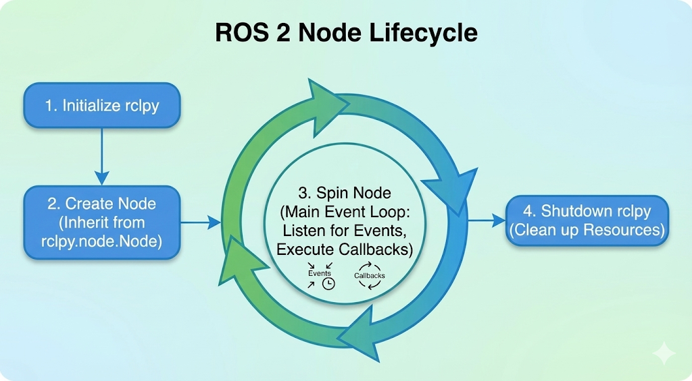
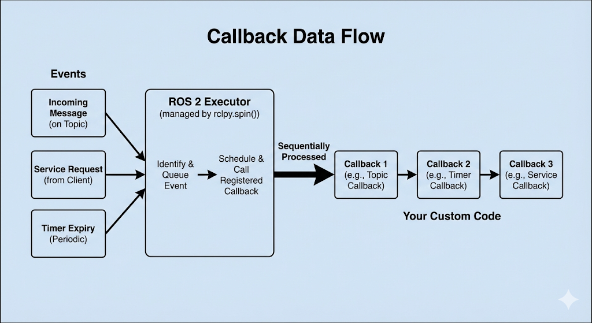

# Chapter 6: Python-Based ROS 2 Development with rclpy

## Chapter Overview

In the previous chapters, we developed a strong conceptual understanding of ROS 2's architecture and its core communication primitives—Topics, Services, and Actions. We can now design robotic software systems on a whiteboard. It's time to turn those designs into running code.

This chapter is where the rubber meets the road. We will bridge the gap from theory to practice by learning how to write ROS 2 applications using **`rclpy`**, the official Python client library for ROS 2. Python's simplicity and ease of use make it the perfect language for learning ROS 2, and `rclpy` provides all the tools you need to build everything from simple test nodes to complex robot behaviors.

By the end of this chapter, you will have the practical, hands-on skills to:
-   Write a basic ROS 2 node in Python.
-   Implement the publish/subscribe pattern by creating publisher and subscriber nodes.
-   Implement the request/response pattern by creating service server and client nodes.
-   Understand the structure of a ROS 2 Action and how to create action servers and clients.
-   Grasp the `rclpy` execution model, including the crucial concepts of "spinning" and callbacks.
-   Use parameters to make your nodes configurable.
-   Run, inspect, and debug your Python nodes.

This chapter lays the foundation for all the practical robotics programming you will do in the rest of this book. Let's start coding.

## Anatomy of a Python ROS 2 Node

Before we dive into publishers and subscribers, let's understand the basic structure of any ROS 2 node written in Python using `rclpy`. Every `rclpy` application follows a common pattern:

1.  **Initialize `rclpy`**: This sets up the ROS 2 client library, allowing it to communicate with the underlying ROS 2 system.
2.  **Create a Node**: Instantiate your custom node class, which inherits from `rclpy.node.Node`. This object represents your node in the ROS 2 computational graph.
3.  **Spin the Node**: This is the most crucial step. `rclpy.spin()` is a blocking call that keeps your node alive, listens for incoming data (messages, service requests, action goals), and executes the appropriate callback functions.
4.  **Shutdown `rclpy`**: After your node is done (e.g., received a shutdown signal), you properly clean up the ROS 2 resources.

Here's a conceptual overview of a node's lifecycle:


*The fundamental lifecycle of an rclpy node, from initialization to spinning and eventual shutdown.*

### Callbacks: Your Code Reacting to Events

ROS 2 is an event-driven system. Your node doesn't continuously poll for data; instead, it provides **callback functions** that are executed when specific events occur.

-   When a message arrives on a subscribed topic, a **topic callback** is triggered.
-   When a service request is received, a **service callback** is triggered.
-   When a timer expires, a **timer callback** is triggered.

The `rclpy.spin()` function is responsible for listening to these events and calling your registered callbacks. You can think of it as the "event loop" that drives your node.


*The flow of data through the executor: events trigger callbacks, which are processed sequentially.*

## Creating a Publisher Node

Let's write our first practical node: a publisher that continuously broadcasts a "Hello World" message to a topic.

This node introduces a few new concepts:
-   **`create_publisher()`**: This `Node` method creates a publisher. You specify the message type (`String`), the topic name (`'topic'`), and the "queue size" (10), which is a quality-of-service (QoS) setting that limits the amount of queued messages if the network is slow.
-   **`create_timer()`**: This `Node` method sets up a timer that will call a given function (`self.timer_callback`) at a regular interval (0.5 seconds). This is a common way to trigger periodic work in ROS 2.
-   **`publish()`**: This method, called on the publisher object, is what actually sends the message over the network.

Here is the complete code for our publisher node. Save it as `textbook/code/chapter6/publisher_node.py`.

```python
import rclpy
from rclpy.node import Node
from std_msgs.msg import String

class MinimalPublisher(Node):

    def __init__(self):
        super().__init__('minimal_publisher')
        self.publisher_ = self.create_publisher(String, 'topic', 10)
        timer_period = 0.5  # seconds
        self.timer = self.create_timer(timer_period, self.timer_callback)
        self.i = 0

    def timer_callback(self):
        msg = String()
        msg.data = 'Hello World: %d' % self.i
        self.publisher_.publish(msg)
        self.get_logger().info('Publishing: "%s"' % msg.data)
        self.i += 1

def main(args=None):
    rclpy.init(args=args)
    minimal_publisher = MinimalPublisher()
    rclpy.spin(minimal_publisher)
    minimal_publisher.destroy_node()
    rclpy.shutdown()

if __name__ == '__main__':
    main()
```

### Dissecting the Code

1.  **Imports**: We import `rclpy`, our base `Node` class, and the `String` message type from `std_msgs.msg`.
2.  **`MinimalPublisher` Class**: Our node logic is encapsulated in this class, which inherits from `Node`.
3.  **`__init__` (Constructor)**:
    -   `super().__init__('minimal_publisher')`: We call the parent `Node` constructor and give our node the name `minimal_publisher`.
    -   `self.create_publisher(...)`: We create a publisher of type `String` on the topic named `topic` with a queue size of 10.
    -   `self.create_timer(...)`: We create a timer that will execute `self.timer_callback` every 0.5 seconds.
4.  **`timer_callback`**:
    -   This function is executed by the `rclpy` spinner every time the timer "ticks".
    -   It creates a `String` message, populates its `data` field, and publishes it using `self.publisher_.publish(msg)`.
    -   `self.get_logger().info(...)` is the standard way to log informational messages to the console in ROS 2.
5.  **`main` function**:
    -   This is the standard entry point for a Python ROS 2 program.
    -   `rclpy.init()`: Initializes ROS 2.
    -   `minimal_publisher = MinimalPublisher()`: Creates an instance of our node.
    -   `rclpy.spin(minimal_publisher)`: Starts the event loop, which will run until the node is shut down (e.g., by pressing Ctrl+C).
    -   `destroy_node()` and `rclpy.shutdown()`: Cleanly releases the node's resources.
    
    ## Creating a Subscriber Node
    
    Now that we have a node publishing messages, we need a node to receive them. The subscriber is the other half of the publish/subscribe pattern.
    
    This node introduces `create_subscription()`:
    -   **`create_subscription()`**: This `Node` method creates a subscriber. You specify the message type (`String`), the topic name (`'topic'`), the callback function to execute when a message arrives (`self.listener_callback`), and the queue size (10).
    
    Here is the code. Save it as `textbook/code/chapter6/subscriber_node.py`.
    
    ```python
    import rclpy
    from rclpy.node import Node
    from std_msgs.msg import String
    
    class MinimalSubscriber(Node):
    
        def __init__(self):
            super().__init__('minimal_subscriber')
            self.subscription = self.create_subscription(
                String,
                'topic',
                self.listener_callback,
                10)
            self.subscription  # prevent unused variable warning
    
        def listener_callback(self, msg):
            self.get_logger().info('I heard: "%s"' % msg.data)
    
    def main(args=None):
        rclpy.init(args=args)
        minimal_subscriber = MinimalSubscriber()
        rclpy.spin(minimal_subscriber)
        minimal_subscriber.destroy_node()
        rclpy.shutdown()
    
    if __name__ == '__main__':
        main()
    ```
    
    ### Dissecting the Code
    
    1.  **`MinimalSubscriber` Class**: The structure is very similar to the publisher.
    2.  **`__init__` (Constructor)**:
        -   `super().__init__('minimal_subscriber')`: We name our subscriber node.
        -   `self.create_subscription(...)`: This is the core of the subscriber. It "listens" on the `topic` topic. Crucially, it tells `rclpy` that whenever a `String` message arrives, it should execute the `self.listener_callback` function.
    3.  **`listener_callback`**:
        -   This function is the "receiver". The `rclpy` spinner executes it whenever a message is available on the subscribed topic.
        -   The `msg` parameter is the actual `String` message object that was received.
        -   We simply log the contents of the message to the console.

## Running Your First Nodes

Now comes the exciting part: seeing it all work together. To run these nodes, you will need two separate terminals. In each terminal, you must first source your ROS 2 environment.

**Terminal 1: Run the Publisher**

```bash
# Make sure you are in your ROS 2 workspace directory
source install/setup.bash
ros2 run <your_package_name> minimal_publisher
```
*Note: Replace `<your_package_name>` with the name of the package where you saved your Python files. If you are running them as standalone scripts, you may need to navigate to the directory and run `python3 publisher_node.py` after sourcing ROS 2.*

You should see the following output, with a new line appearing every half-second:
```
[INFO] [minimal_publisher]: Publishing: "Hello World: 0"
[INFO] [minimal_publisher]: Publishing: "Hello World: 1"
[INFO] [minimal_publisher]: Publishing: "Hello World: 2"
...
```

**Terminal 2: Run the Subscriber**

```bash
# Make sure you are in your ROS 2 workspace directory
source install/setup.bash
ros2 run <your_package_name> minimal_subscriber
```

Almost instantly, you will see the subscriber's output as it starts receiving the messages published by the other node:
```
[INFO] [minimal_subscriber]: I heard: "Hello World: 0"
[INFO] [minimal_subscriber]: I heard: "Hello World: 1"
[INFO] [minimal_subscriber]: I heard: "Hello World: 2"
...
```

Congratulations! You have just created and run your first distributed robotics application. A node is publishing data, another is subscribing to it, and ROS 2 is handling all the underlying discovery and communication for you.

## Creating a Service Server

Next, we'll implement the request/response pattern with a ROS 2 Service. Our service will take two integers (`a` and `b`) and return their sum.

This introduces `create_service()`:
-   **`create_service()`**: This `Node` method creates a service server. You specify the service type (`AddTwoInts`), the service name (`'add_two_ints'`), and the callback function to execute when a request arrives (`self.add_two_ints_callback`).

The `AddTwoInts.srv` definition, provided by the `example_interfaces` package, looks like this:
```
int64 a
int64 b
---
int64 sum
```
The first part is the request, the second is the response.

Here is the code for the server. Save it as `textbook/code/chapter6/service_server.py`.

```python
from example_interfaces.srv import AddTwoInts
import rclpy
from rclpy.node import Node

class MinimalService(Node):

    def __init__(self):
        super().__init__('minimal_service')
        self.srv = self.create_service(AddTwoInts, 'add_two_ints', self.add_two_ints_callback)

    def add_two_ints_callback(self, request, response):
        response.sum = request.a + request.b
        self.get_logger().info('Incoming request\na: %d b: %d' % (request.a, request.b))
        self.get_logger().info('Sending back response: [%d]' % response.sum)
        return response

def main(args=None):
    rclpy.init(args=args)
    minimal_service = MinimalService()
    rclpy.spin(minimal_service)
    rclpy.shutdown()

if __name__ == '__main__':
    main()
```

### Dissecting the Code

1.  **Imports**: We import `AddTwoInts` from `example_interfaces.srv`.
2.  **`create_service`**: In the constructor, we create the service, linking it to the `add_two_ints_callback`.
3.  **`add_two_ints_callback`**:
    -   This function receives two arguments: `request` and `response`.
    -   The `request` object contains the input data sent by the client (e.g., `request.a`, `request.b`).
    -   You are responsible for populating the fields of the `response` object (e.g., `response.sum`).
    -   The function must return the populated `response` object.

## Creating a Service Client

Now, let's create the client node that calls the service. This node is a bit different; it doesn't need to spin forever. It will start up, send a request, wait for the response, print it, and then exit.

This introduces a few more concepts:
-   **`create_client()`**: This `Node` method creates a client for a specific service.
-   **`wait_for_service()`**: A crucial step. The client will pause and wait until the service server is actually running and available on the network.
-   **`call_async()`**: This sends the request to the server. As the name implies, it is an *asynchronous* call. It returns a "future" object immediately.
-   **`rclpy.spin_until_future_complete()`**: This function effectively "spins" the node just long enough to get the result from the future.

Here is the code. Save it as `textbook/code/chapter6/service_client.py`.

```python
import sys
from example_interfaces.srv import AddTwoInts
import rclpy
from rclpy.node import Node

class MinimalClientAsync(Node):

    def __init__(self):
        super().__init__('minimal_client_async')
        self.cli = self.create_client(AddTwoInts, 'add_two_ints')
        while not self.cli.wait_for_service(timeout_sec=1.0):
            self.get_logger().info('service not available, waiting again...')
        self.req = AddTwoInts.Request()

    def send_request(self, a, b):
        self.req.a = a
        self.req.b = b
        self.future = self.cli.call_async(self.req)
        rclpy.spin_until_future_complete(self, self.future)
        return self.future.result()

def main(args=None):
    rclpy.init(args=args)

    if len(sys.argv) != 3:
        print("Usage: ros2 run <package_name> <executable_name> <a> <b>")
        return

    a = int(sys.argv[1])
    b = int(sys.argv[2])

    minimal_client = MinimalClientAsync()
    response = minimal_client.send_request(a, b)
    minimal_client.get_logger().info(
        'Result of add_two_ints: for %d + %d = %d' %
        (a, b, response.sum))

    minimal_client.destroy_node()
    rclpy.shutdown()

if __name__ == '__main__':
    main()
```

### Dissecting the Code

1.  **Command-Line Arguments**: The `main` function now checks `sys.argv` to get the two integers to be added from the command line.
2.  **`MinimalClientAsync` Class**:
    -   In `__init__`, we `create_client` and then enter a `while` loop with `self.cli.wait_for_service()`. This prevents the client from trying to call a service that doesn't exist yet.
    -   `send_request` populates the request object (`self.req`), calls the service asynchronously, and then spins the node until the `future` is complete (i.e., the response has been received). It then returns the `result` of the future.
3.  **Running the Service and Client**:
    -   **Terminal 1**: `ros2 run <your_package> minimal_service`
    -   **Terminal 2**: `ros2 run <your_package> minimal_client 5 10`
    -   The client will print the result (`Result... 15`) and exit, while the server remains running, ready for more requests.

## Creating an Action Server

Actions are for long-running, asynchronous tasks that provide continuous feedback and are cancellable. Think of telling a robot to navigate to a goal: the journey might take a while, you want updates on its progress, and you might want to tell it to stop.

An action has three parts:
-   **Goal**: The request sent by the client (e.g., "navigate to position X").
-   **Feedback**: A stream of updates from the server (e.g., "current distance to goal is Y").
-   **Result**: A final summary sent by the server when the goal is complete (e.g., "arrived successfully").

Here's a conceptual server for a Fibonacci sequence action. Save it as `textbook/code/chapter6/action_server.py`.

```python
import time
import rclpy
from rclpy.action import ActionServer
from rclpy.node import Node
from action_tutorials_interfaces.action import Fibonacci

class FibonacciActionServer(Node):

    def __init__(self):
        super().__init__('fibonacci_action_server')
        self._action_server = ActionServer(
            self,
            Fibonacci,
            'fibonacci',
            self.execute_callback)

    def execute_callback(self, goal_handle):
        self.get_logger().info('Executing goal...')

        feedback_msg = Fibonacci.Feedback()
        feedback_msg.sequence = [0, 1]

        for i in range(1, goal_handle.request.order):
            feedback_msg.sequence.append(feedback_msg.sequence[i] + feedback_msg.sequence[i-1])
            self.get_logger().info('Feedback: {0}'.format(feedback_msg.sequence))
            goal_handle.publish_feedback(feedback_msg)
            time.sleep(1)

        goal_handle.succeed()

        result = Fibonacci.Result()
        result.sequence = feedback_msg.sequence
        return result

def main(args=None):
    rclpy.init(args=args)
    fibonacci_action_server = FibonacciActionServer()
    rclpy.spin(fibonacci_action_server)

if __name__ == '__main__':
    main()
```

### Dissecting the Code

1.  **`ActionServer`**: We create an `ActionServer`, providing the action type (`Fibonacci`), the action name (`'fibonacci'`), and the `execute_callback`.
2.  **`execute_callback`**: This is where the magic happens.
    -   It receives a `goal_handle` object.
    -   Inside a loop, it does its work (calculating the sequence).
    -   `goal_handle.publish_feedback()`: Periodically sends feedback to the client.
    -   `goal_handle.succeed()`: When the work is done, it marks the goal as successful.
    -   Finally, it creates and returns a `Result` object.

## Creating an Action Client

The action client is more complex than the service client because it's a multi-stage, asynchronous process involving several callbacks.

Here's the conceptual code for the client. Save it as `textbook/code/chapter6/action_client.py`.

```python
import rclpy
from rclpy.action import ActionClient
from rclpy.node import Node
from action_tutorials_interfaces.action import Fibonacci

class FibonacciActionClient(Node):

    def __init__(self):
        super().__init__('fibonacci_action_client')
        self._action_client = ActionClient(self, Fibonacci, 'fibonacci')

    def send_goal(self, order):
        goal_msg = Fibonacci.Goal()
        goal_msg.order = order

        self._action_client.wait_for_server()

        self._send_goal_future = self._action_client.send_goal_async(goal_msg, feedback_callback=self.feedback_callback)
        self._send_goal_future.add_done_callback(self.goal_response_callback)

    def goal_response_callback(self, future):
        goal_handle = future.result()
        if not goal_handle.accepted:
            self.get_logger().info('Goal rejected :(')
            return

        self.get_logger().info('Goal accepted :)')

        self._get_result_future = goal_handle.get_result_async()
        self._get_result_future.add_done_callback(self.get_result_callback)

    def get_result_callback(self, future):
        result = future.result().result
        self.get_logger().info('Result: {0}'.format(result.sequence))
        rclpy.shutdown()

    def feedback_callback(self, feedback_msg):
        feedback = feedback_msg.feedback
        self.get_logger().info('Received feedback: {0}'.format(feedback.sequence))

def main(args=None):
    rclpy.init(args=args)
    action_client = FibonacciActionClient()
    action_client.send_goal(10)
    rclpy.spin(action_client)

if __name__ == '__main__':
    main()
```

### Dissecting the Code

The flow is entirely callback-driven:
1.  **`send_goal`**:
    -   We create an `ActionClient`.
    -   We call `send_goal_async`, passing it our goal AND the feedback callback. This returns a future.
    -   We attach `goal_response_callback` to be called when the future completes (i.e., when the server accepts/rejects the goal).
2.  **`goal_response_callback`**:
    -   Checks if the goal was accepted.
    -   If so, it requests the result from the server using `get_result_async()`, which also returns a future.
    -   It attaches `get_result_callback` to this new future.
3.  **`feedback_callback`**: This function is called by the `rclpy` spinner whenever the server publishes feedback.
4.  **`get_result_callback`**: This is called only when the server has finished and sent the final result. It prints the result and shuts down the node.

## Using Parameters in `rclpy`

Parameters allow you to configure your nodes externally without changing the code. You can set them from the command line, in launch files, or from other nodes.

Here's a simple node that declares a parameter. Save it as `textbook/code/chapter6/parameter_node.py`.

```python
import rclpy
from rclpy.node import Node
from rclpy.exceptions import ParameterNotDeclaredException
from rcl_interfaces.msg import ParameterType

class MinimalParameterNode(Node):

    def __init__(self):
        super().__init__('minimal_param_node')
        self.declare_parameter('my_parameter', 'world')
        self.timer = self.create_timer(1, self.timer_callback)

    def timer_callback(self):
        my_param = self.get_parameter('my_parameter').get_parameter_value().string_value
        self.get_logger().info('Hello %s!' % my_param)

def main(args=None):
    rclpy.init(args=args)
    node = MinimalParameterNode()
    rclpy.spin(node)
    node.destroy_node()
    rclpy.shutdown()

if __name__ == '__main__':
    main()
```

### Dissecting the Code

1.  **`declare_parameter()`**: In the constructor, we declare a parameter named `my_parameter` and give it a default value of `'world'`.
2.  **`get_parameter()`**: In the timer callback, we retrieve the current value of the parameter.
3.  **Running and Modifying**:
    -   **Terminal 1**: `ros2 run <your_package> minimal_param_node`
    -   Initially, it will print "Hello world!".
    -   **Terminal 2**: `ros2 param set minimal_param_node my_parameter earth`
    -   The output in the first terminal will immediately change to "Hello earth!".

## Logging and Debugging

Effective logging is crucial for understanding and debugging your robotics application. `rclpy` provides a simple and powerful logging framework.

### Using the Node Logger

You've already seen `self.get_logger().info()`. The logger has several severity levels:
-   `DEBUG`: Detailed information, typically only needed when debugging a specific issue.
-   `INFO`: General informational messages about the node's state.
-   `WARN`: Indicates a potential problem that doesn't prevent the node from running.
-   `ERROR`: Indicates a problem that has occurred but the node can continue.
-   `FATAL`: Indicates a problem that is causing the node to terminate.

```python
self.get_logger().debug('This is a debug message.')
self.get_logger().info('Node is starting up.')
self.get_logger().warn('Sensor data is stale.')
self.get_logger().error('Could not connect to database.')
self.get_logger().fatal('Critical hardware failure!')
```

By default, only messages of level `INFO` and higher are displayed. You can change this using command-line arguments to `ros2 run`.

### Common Debugging Tools

When your nodes aren't behaving as expected, the `ros2` command-line tool is your best friend.
-   **`ros2 node list`**: See all running nodes.
-   **`ros2 topic list`**: See all active topics.
-   **`ros2 service list`**: See all available services.
-   **`ros2 node info <node_name>`**: Get a detailed report on a specific node, including its publications, subscriptions, services, and actions.
-   **`ros2 topic echo <topic_name>`**: Print the messages being published on a topic to the console. Invaluable for checking if your publisher is working correctly.
-   **`ros2 service call <service_name> <service_type> '<request_in_yaml>'`**: Call a service from the command line to test your server.

## Common Coding Patterns & Performance

As you write more `rclpy` nodes, you'll encounter some common patterns and considerations.

### Patterns

-   **Classes for Nodes**: Always structure your nodes as Python classes inheriting from `rclpy.node.Node`. This keeps your code organized, encapsulates state, and is the standard ROS 2 convention.
-   **Timers for Periodic Work**: For any task that needs to run at a regular interval (like polling a sensor or publishing status), use `create_timer`. It's more efficient and cleaner than `time.sleep()` in a `while` loop.
-   **Separation of Concerns**: A single node should have a single, clear responsibility. If a node is doing too many things, consider splitting it into multiple smaller nodes that communicate via topics or services.

### Performance: Python vs. C++

-   **Ease of Use**: Python is fantastic for rapid prototyping, high-level logic, and non-critical tasks. Its simplicity allows you to focus on the application logic rather than memory management.
-   **Performance-Critical Nodes**: For nodes that require very high frequency (e.g., > 100 Hz), low latency, or intense computation (like processing point cloud data), C++ is the better choice. The `rclcpp` client library is designed for performance.
-   **The Hybrid Approach**: A common and powerful pattern in ROS 2 is to build a hybrid system. Use C++ for the performance-critical, low-level nodes and Python for the high-level coordination, state management, and user interface nodes.

### A Note on QoS

You saw the `queue_size` argument (e.g., `10`) in our publisher and subscriber. This is a Quality of Service (QoS) setting. QoS is a rich and complex topic that allows you to fine-tune the reliability and delivery of messages. We will cover it in more detail in a later chapter, but for now, a queue size of 10 is a sensible default for most applications.

## Hands-On Exercises

It's time to put your new knowledge to the test.

### 1. Greeter Bot

**Goal**: Create a system where one node publishes a "greeting" and another node subscribes and prints a personalized reply.

1.  **Create a `greeter_publisher` node**:
    -   It should publish a `String` message to the topic `greeting`.
    -   The message should contain a name, e.g., "Alice".
    -   It should publish the message once per second.
2.  **Create a `greeter_subscriber` node**:
    -   It should subscribe to the `greeting` topic.
    -   In its callback, it should log a reply, e.g., "Hello Alice! This is the greeter bot."
3.  **Run them**:
    -   Run both nodes in separate terminals and verify that the subscriber is printing the correct reply.

### 2. Simple Calculator Service

**Goal**: Create a service that can perform basic arithmetic.

1.  **Create a `calculator_server` node**:
    -   It should offer a service named `calculate`.
    -   Use the `AddTwoInts` service type for simplicity.
    -   The callback should not just add the numbers, but perform an operation based on a parameter.
2.  **Add a Parameter**:
    -   Declare a string parameter on the server named `operation` with a default value of `add`.
    -   In the service callback, check the value of this parameter. If it's `add`, perform addition. If it's `subtract`, perform subtraction.
3.  **Create a `calculator_client` node**:
    -   This client should take three command-line arguments: `a`, `b`, and `operation`.
4.  **Run them**:
    -   Run the server.
    -   Run the client: `ros2 run <your_package> calculator_client 10 5` (This should default to addition).
    -   Change the operation: `ros2 param set calculator_server operation subtract`.
    -   Run the client again: `ros2 run <your_package> calculator_client 10 5`.
    -   Verify that the output changes from 15 to 5.
    