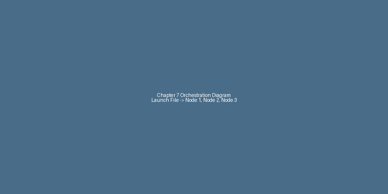
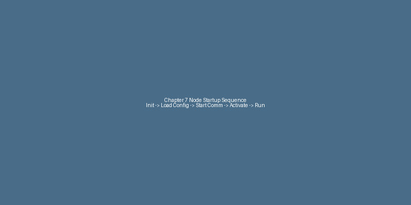

# Chapter 7: Launch Files, Parameters, and System Orchestration

## Chapter Overview

In the previous chapter, you mastered the art of writing individual ROS 2 nodes in Python using `rclpy` to implement topics, services, actions, and parameters. You can now build the basic components of a robotic system. But real robots are rarely just a single node; they are complex orchestrations of many interacting nodes, often performing diverse functions simultaneously.

This chapter is the bridge from individual node development to **system-level orchestration**. We will move beyond starting nodes one by one in separate terminals and learn how to manage an entire multi-node ROS 2 application with a single command using **Python-based launch files**.

By the end of this chapter, you will have the practical skills to:
-   Understand the critical role of launch files in managing complex robotic systems.
-   Create Python launch files to start, configure, and orchestrate multiple ROS 2 nodes.
-   Effectively use ROS 2 Parameters, including declaring them, loading them from YAML files, and configuring them at runtime.
-   Implement Namespaces and Remapping to manage naming conflicts and isolate subsystems in multi-robot or complex single-robot applications.
-   Gain a conceptual understanding of Lifecycle (Managed) Nodes for building more robust and predictable system startup and shutdown sequences.

This chapter is fundamental for transitioning your ROS 2 development from individual components to coherent, production-ready robotic applications. Let's learn how to orchestrate our robotic symphony!

## Why Launch Files?

In Chapter 6, you learned how to compile and run individual ROS 2 nodes using `ros2 run`. For simple nodes, this is perfectly fine. You open a terminal, source your ROS 2 environment, and type `ros2 run <package> <executable>`. If you need another node, you open another terminal and repeat the process.

However, this approach quickly becomes unwieldy as your robotic system grows. Imagine a humanoid robot with:
-   Multiple camera drivers
-   Lidar and IMU sensors
-   Joint controllers for each arm, leg, and head
-   Navigation stack nodes (mapping, localization, path planning)
-   Perception algorithms (object detection, facial recognition)
-   High-level decision-making nodes

You might have dozens, if not hundreds, of nodes that need to start together, potentially with specific parameters, remapped topics, or in a particular order. Manually launching each node from the command line would be tedious, error-prone, and nearly impossible to manage consistently.

This is where **ROS 2 Launch Files** come in.

A launch file is essentially a recipe for starting and configuring a complex ROS 2 system. Instead of typing many `ros2 run` commands, you write a single launch file that describes:
-   **Which nodes to start**: Specify the package and executable for each node.
-   **How to configure them**: Set parameters, remap topic/service names, assign namespaces.
-   **Dependencies and order**: Define actions that might need to happen before or after other nodes.
-   **Other processes**: Integrate non-ROS executables, RViz, bag recording, etc.

By using launch files, you transform the chaotic startup of multiple individual nodes into a streamlined, reproducible, and easily manageable process. It's the difference between trying to assemble a symphony orchestra by individually telling each musician when to play, versus conducting them with a single score.


## Anatomy of a Python Launch File


ROS 2 launch files are powerful because they are written in Python. This means you can use the full expressive power of Python to define your system's startup behavior, including conditionals, loops, and custom logic.


Every Python launch file follows a basic structure: it must contain a function named `generate_launch_description()`. This function returns a `LaunchDescription` object, which is the root element that defines all the actions to be performed when the launch file is executed.


Here's a minimal example:


```python

from launch import LaunchDescription

from launch_ros.actions import Node


def generate_launch_description():

    return LaunchDescription([

        Node(

            package='<your_package_name>',

            executable='<your_node_executable>',

            name='<your_node_name>'

        )

    ])

```


Let's break down the key components:


1.  **`generate_launch_description()` function**:

    -   This is the entry point for every launch file. When you run `ros2 launch`, this function is called.

    -   It must return a `LaunchDescription` object.


2.  **`LaunchDescription`**:

    -   This is the container for all the actions that your launch file will perform.

    -   You pass a list of "actions" to its constructor. An action is essentially something you want the launch system to *do*.


3.  **`Node` action**:

    -   This is the most common action, used to launch a ROS 2 node.

    -   **`package`**: The name of the ROS 2 package where your node executable is located (e.g., `my_robot_pkg`).

    -   **`executable`**: The name of the executable file for your node (e.g., `talker` for a `talker` node). This is the same name you would use with `ros2 run`.

    -   **`name` (optional)**: Assigns a specific name to the node instance. If not provided, the node will use the name defined in its source code. Explicitly naming nodes is good practice.


This basic structure provides the foundation for building increasingly complex orchestration systems.

## Launching a Single Node

Let's start with the simplest use case: launching just one ROS 2 node using a launch file. This might seem like overkill if you could just use `ros2 run`, but it's an important first step to understand the mechanics, and it allows for easier configuration.

First, let's create a very simple ROS 2 Python node that just prints a message when it starts up. Save this file as `textbook/code/chapter7/simple_node.py`:

```python
import rclpy
from rclpy.node import Node

class SimpleNode(Node):
    def __init__(self):
        super().__init__('simple_node')
        self.get_logger().info('Hello from simple_node!')

def main(args=None):
    rclpy.init(args=args)
    node = SimpleNode()
    try:
        rclpy.spin(node)
    except KeyboardInterrupt:
        pass
    node.destroy_node()
    rclpy.shutdown()

if __name__ == '__main__':
    main()
```

Now, create a launch file that starts this `simple_node.py`. Save this file as `textbook/code/chapter7/simple_launch.py`:

```python
from launch import LaunchDescription
from launch_ros.actions import Node

def generate_launch_description():
    return LaunchDescription([
        Node(
            package='<your_ros2_package_name>', # Replace with your package name, e.g., 'my_robot_bringup'
            executable='simple_node',
            name='my_simple_node',
            output='screen' # Directs node output to the console where ros2 launch is run
        )
    ])
```

### Understanding `output='screen'`

The `output='screen'` argument in the `Node` action is important. By default, ROS 2 nodes launched via a launch file send their `stdout` and `stderr` to log files. While this is good for production systems, for development and debugging, you usually want to see the output directly in your terminal. `output='screen'` ensures this.

### Running the Launch File

To run this, first ensure your ROS 2 environment is sourced. Then, you would typically run it from within the root of your ROS 2 workspace (if `chapter7_examples` is a package there):

```bash
ros2 launch <your_ros2_package_name> simple_launch.py
```

*Note: Replace `<your_ros2_package_name>` with the actual name of your ROS 2 package where you've placed `simple_node.py` and `simple_launch.py`. If you're running these as standalone files outside a package for testing, you might need to adapt your launch command or place them in a dummy package.*

You should see output similar to this, confirming your node has launched:

```
[INFO] [launch]: All log files can be found below /home/user/ros2_ws/log/
[INFO] [launch]: Default logging verbosity is set to INFO
[INFO] [my_simple_node-1]: process started with pid [12345]
[my_simple_node-1] Hello from simple_node!
```

You can stop the launch file by pressing `Ctrl+C`.

## Launching Multiple Nodes

The true power of launch files becomes apparent when you need to start and manage multiple nodes. Let's take the publisher and subscriber nodes you created in Chapter 6 and launch them together using a single launch file.

First, ensure you have `publisher_node.py` and `subscriber_node.py` in your `textbook/code/chapter7/` directory (you can copy them from `textbook/code/chapter6/`).

Now, create a new launch file. Save it as `textbook/code/chapter7/multi_node_launch.py`:

```python
from launch import LaunchDescription
from launch_ros.actions import Node

def generate_launch_description():
    return LaunchDescription([
        Node(
            package='<your_ros2_package_name>', # Replace with your package name, e.g., 'my_robot_bringup'
            executable='publisher_node',
            name='my_publisher',
            output='screen'
        ),
        Node(
            package='<your_ros2_package_name>', # Replace with your package name, e.g., 'my_robot_bringup'
            executable='subscriber_node',
            name='my_subscriber',
            output='screen'
        )
    ])
```

### Running the Multi-Node Launch File

As before, make sure your ROS 2 environment is sourced, and then run:

```bash
ros2 launch <your_ros2_package_name> multi_node_launch.py
```

You should now see both the publisher and subscriber nodes start simultaneously, and you'll observe the "Hello World" messages being published and heard in the same terminal:

```
[INFO] [launch]: All log files can be found below /home/user/ros2_ws/log/
[INFO] [launch]: Default logging verbosity is set to INFO
[INFO] [my_publisher-1]: process started with pid [12345]
[INFO] [my_subscriber-2]: process started with pid [12346]
[my_publisher-1] Publishing: "Hello World: 0"
[my_subscriber-2] I heard: "Hello World: 0"
[my_publisher-1] Publishing: "Hello World: 1"
[my_subscriber-2] I heard: "Hello World: 1"
...
```

This single command launched an entire communication system. This capability is fundamental to building complex robot applications, where various sensors, actuators, and algorithms need to operate concurrently.


*A launch file orchestrating the startup and configuration of multiple ROS 2 nodes in a coordinated system.*

## Introducing Parameters

In Chapter 6, you briefly encountered parameters as a way to configure the behavior of your individual `rclpy` nodes (e.g., changing a "Hello World" message at runtime). Now, with launch files, parameters become even more powerful, allowing you to configure an entire system of nodes from a central point.

Parameters are essentially key-value pairs that a node exposes. They enable you to customize a node's behavior without modifying and recompiling its source code. Think of them as tunable knobs for your robot's software.

Common uses for parameters include:
-   **Sensor Configuration**: Setting a camera's frame rate, resolution, or exposure.
-   **Navigation Settings**: Adjusting a robot's maximum speed, obstacle avoidance thresholds, or path planning algorithms.
-   **Behavior Control**: Changing a gripper's open/close position, or a robot's operating mode (e.g., "manual" vs. "autonomous").

### How Parameters Work in Launch Files

When you launch a node, you can provide initial values for its parameters directly within the `Node` action of your launch file. This allows for dynamic configuration of your entire robotic system at startup. Any parameter not explicitly set will typically fall back to a default value defined within the node's source code (as you saw with `self.declare_parameter()`).

By externalizing these settings, launch files enhance the flexibility, reusability, and ease of management for your ROS 2 applications.

## Using YAML for Parameters

While you can set individual parameters directly in the `Node` action, for complex nodes or systems with many parameters, it's much cleaner and more organized to define them in a YAML file. This is the recommended practice for managing parameters in ROS 2.

Let's create a simple node that declares two parameters: `message` (string) and `publish_frequency` (double). Save this as `textbook/code/chapter7/param_node.py`:

```python
import rclpy
from rclpy.node import Node
from std_msgs.msg import String

class ParamNode(Node):
    def __init__(self):
        super().__init__('my_hello_world_node')
        self.declare_parameter('message', 'Default Hello')
        self.declare_parameter('publish_frequency', 1.0)

        # Retrieve parameter values
        self.message = self.get_parameter('message').get_parameter_value().string_value
        self.publish_frequency = self.get_parameter('publish_frequency').get_parameter_value().double_value

        self.publisher_ = self.create_publisher(String, 'hello_topic', 10)
        # Create a timer that publishes at the specified frequency
        self.timer = self.create_timer(1.0 / self.publish_frequency, self.timer_callback)
        self.get_logger().info(f'Node initialized with message: "{self.message}" and frequency: {self.publish_frequency} Hz')

    def timer_callback(self):
        msg = String()
        msg.data = self.message
        self.publisher_.publish(msg)
        self.get_logger().info(f'Publishing: "{msg.data}"')

def main(args=None):
    rclpy.init(args=args)
    node = ParamNode()
    rclpy.spin(node)
    node.destroy_node()
    rclpy.shutdown()

if __name__ == '__main__':
    main()
```

Next, create a YAML file to define the parameters for this node. Save it as `textbook/code/chapter7/params.yaml`:

```yaml
my_hello_world_node:
  ros__parameters:
    message: "Hello from YAML parameters!"
    publish_frequency: 2.0 # Publish twice per second
```

### Understanding the YAML Structure

-   The top-level key (`my_hello_world_node`) should match the name of your node.
-   `ros__parameters`: This is a special key that indicates the following entries are ROS 2 parameters for that node.
-   Inside `ros__parameters`, you list your parameters as key-value pairs.

Finally, create a launch file to load these parameters. Save it as `textbook/code/chapter7/param_launch.py`:

```python
from launch import LaunchDescription
from launch_ros.actions import Node
from launch.substitutions import PathJoinSubstitution
from launch_ros.substitutions import FindPackageShare

def generate_launch_description():
    # Define the path to the parameter file
    param_file = PathJoinSubstitution(
        [
            FindPackageShare('<your_ros2_package_name>'), # Replace with your package name
            'config', # Assuming a 'config' directory in your package
            'params.yaml'
        ]
    )

    return LaunchDescription([
        Node(
            package='<your_ros2_package_name>', # Replace with your package name
            executable='param_node',
            name='my_hello_world_node',
            output='screen',
            parameters=[param_file] # Load parameters from the YAML file
        )
    ])
```

*Note: In the `param_launch.py`, I've updated the `param_file` path to assume a `config` directory within your package, which is a common ROS 2 convention. You might need to adjust this based on your actual package structure.*

### Running with YAML Parameters

To see this in action:
1.  Launch the node: `ros2 launch <your_ros2_package_name> param_launch.py`
2.  You should see the node logging "Hello from YAML parameters!" at 2 Hz, as defined in your `params.yaml` file.
3.  You can still override individual parameters from the command line:
    `ros2 launch <your_ros2_package_name> param_launch.py parameters:=[{"name": "message", "value": "Override from CLI!"}]`

## Namespaces for Multi-Robot Systems

As your robotic applications grow, especially in scenarios with multiple robots or multiple instances of the same robot subsystem (e.g., two robotic arms), you'll quickly encounter a problem: naming conflicts. If two robots each have a `/camera` topic, how does a subscriber know which camera it's listening to?

ROS 2 **namespaces** provide a solution to this problem by creating isolated naming environments. A namespace acts as a prefix to all the names within it (nodes, topics, services, actions, and parameters).

### How Namespaces Work

By default, all nodes run in the global namespace (`/`). You can assign a node to a specific namespace using the `namespace` argument in the `Node` action.

Let's imagine we want to launch two sets of our publisher/subscriber system, one for `robot1` and one for `robot2`.

Save this launch file as `textbook/code/chapter7/namespaced_launch.py`:

```python
from launch import LaunchDescription
from launch_ros.actions import Node

def generate_launch_description():
    robot1_nodes = [
        Node(
            package='<your_ros2_package_name>', # Replace with your package name
            executable='publisher_node',
            name='my_publisher',
            namespace='robot1',
            output='screen'
        ),
        Node(
            package='<your_ros2_package_name>', # Replace with your package name
            executable='subscriber_node',
            name='my_subscriber',
            namespace='robot1',
            output='screen'
        )
    ]

    robot2_nodes = [
        Node(
            package='<your_ros2_package_name>', # Replace with your package name
            executable='publisher_node',
            name='my_publisher',
            namespace='robot2',
            output='screen'
        ),
        Node(
            package='<your_ros2_package_name>', # Replace with your package name
            executable='subscriber_node',
            name='my_subscriber',
            namespace='robot2',
            output='screen'
        )
    ]

    return LaunchDescription(robot1_nodes + robot2_nodes)
```

### Observing Namespaced Nodes and Topics

When you launch this file (`ros2 launch <your_ros2_package_name> namespaced_launch.py`), you'll notice:

-   Node names will become `/robot1/my_publisher`, `/robot1/my_subscriber`, `/robot2/my_publisher`, `/robot2/my_subscriber`.
-   Topic names will become `/robot1/topic` and `/robot2/topic`.

Each `robot1` publisher will only communicate with the `robot1` subscriber on `/robot1/topic`, and similarly for `robot2`. This completely isolates the two systems, allowing them to operate independently without interference.

Namespaces are essential for building modular and scalable ROS 2 applications, especially for humanoid robots that might have multiple similar components (e.g., left arm control, right arm control) or when deploying fleets of robots.


*A conceptual diagram illustrating how namespaces create isolated naming contexts for nodes and topics, enabling multiple instances of a system to run without conflict.*

## Remapping Topics

Sometimes, instead of using namespaces to group an entire set of nodes and their communication, you might simply want to change the name of a single topic, service, or action that a node uses. This is where **remapping** comes in.

Remapping allows you to assign an alias to a name at runtime, without modifying the node's source code. It's incredibly useful for:
-   Connecting nodes that were developed independently and use different naming conventions.
-   Testing different sensor inputs or control outputs with the same processing node.
-   Adapting existing nodes to a new system architecture.

### How Remapping Works

You specify remapping rules as a list of `(original_name, new_name)` tuples within the `remappings` argument of a `Node` action.

Let's modify our publisher and subscriber example. Imagine our publisher publishes to `topic`, but we want our subscriber to listen to `new_topic`. We can remap `topic` to `new_topic` for both nodes in the launch file.

Save this launch file as `textbook/code/chapter7/remap_launch.py`:

```python
from launch import LaunchDescription
from launch_ros.actions import Node

def generate_launch_description():
    return LaunchDescription([
        Node(
            package='<your_ros2_package_name>', # Replace with your package name
            executable='publisher_node',
            name='my_publisher',
            output='screen',
            remappings=[
                ('topic', 'remapped_topic') # Remap 'topic' to 'remapped_topic'
            ]
        ),
        Node(
            package='<your_ros2_package_name>', # Replace with your package name
            executable='subscriber_node',
            name='my_subscriber',
            output='screen',
            remappings=[
                ('topic', 'remapped_topic') # Remap 'topic' to 'remapped_topic'
            ]
        )
    ])
```

### Running with Remapping

When you run this launch file (`ros2 launch <your_ros2_package_name> remap_launch.py`), both the publisher and subscriber will communicate over the topic `/remapped_topic`, even though their internal code refers to `'topic'`.

You can verify this using ROS 2 introspection tools:
-   `ros2 topic list` will show `/remapped_topic`.
-   `ros2 topic info /remapped_topic` will show `my_publisher` and `my_subscriber` as publisher and subscriber respectively.

Remapping is a powerful tool for maintaining flexibility and modularity in your ROS 2 system, allowing you to adapt node interfaces without altering their core logic.

## Including Other Launch Files

As your robot's software system grows, so will the complexity of your launch files. Just like with code, it's good practice to break down large launch files into smaller, more manageable, and reusable components. ROS 2 allows you to include one launch file within another, promoting modularity and simplifying the management of complex systems.

This is particularly useful when:
-   You have a common set of nodes (e.g., all the drivers for a specific sensor package) that you want to launch together in different contexts.
-   You are building a complex robot where different subsystems (e.g., navigation, manipulation, perception) have their own launch files, and a top-level launch file orchestrates them all.

### How to Include Launch Files

You use the `IncludeLaunchDescription` action, typically with a `PythonLaunchDescriptionSource` to specify the launch file to include.

Let's create a simple sub-launch file that just starts our `simple_node.py`. Save this as `textbook/code/chapter7/sub_launch.py`:

```python
from launch import LaunchDescription
from launch_ros.actions import Node

def generate_launch_description():
    return LaunchDescription([
        Node(
            package='<your_ros2_package_name>', # Replace with your package name
            executable='simple_node',
            name='included_simple_node',
            output='screen'
        )
    ])
```

Now, create a main launch file that includes this `sub_launch.py`. Save this as `textbook/code/chapter7/main_launch.py`:

```python
from launch import LaunchDescription
from launch.actions import IncludeLaunchDescription
from launch.launch_description_sources import PythonLaunchDescriptionSource
from ament_index_python.packages import get_package_share_directory
import os

def generate_launch_description():
    # Define the path to the sub_launch.py file
    # Replace '<your_ros2_package_name>' with your actual package name
    your_package_share_dir = get_package_share_directory('<your_ros2_package_name>')
    
    sub_launch_file_path = os.path.join(
        your_package_share_dir,
        'launch', # Assuming sub_launch.py is in a 'launch' directory within your package
        'sub_launch.py'
    )

    return LaunchDescription([
        IncludeLaunchDescription(
            PythonLaunchDescriptionSource(sub_launch_file_path)
        ),
        # You can add other nodes or actions here
        # Node(
        #     package='<your_ros2_package_name>',
        #     executable='another_node',
        #     name='my_another_node',
        #     output='screen'
        # )
    ])
```

### Key Components for Including

-   **`IncludeLaunchDescription`**: This action takes a `LaunchDescriptionSource` object as an argument.
-   **`PythonLaunchDescriptionSource`**: Used when you are including another Python launch file. It requires the full path to the launch file.
-   **`ament_index_python.packages.get_package_share_directory()`**: This utility function is essential for reliably finding files within ROS 2 packages, regardless of where your workspace is located. It allows you to construct paths to resources like launch files, configuration files, or data files within your package.

### Running the Main Launch File

When you run `ros2 launch <your_ros2_package_name> main_launch.py`, it will execute `sub_launch.py`, which in turn launches `included_simple_node`. This creates a hierarchy of launch files, making your system more organized and easier to manage.

## Debugging Launch Failures

Launch files, while powerful, can sometimes be tricky to debug when things go wrong. Because they orchestrate many processes, a failure in one can cascade and make the entire system seem broken. Here are common issues and strategies for diagnosing them:

### Common Failure Modes

1.  **Node Not Starting**:
    -   **Symptom**: `[ERROR] [launch]: Caught exception when trying to launch node...` or `process died with exit code ...`.
    -   **Cause**: Incorrect `package` or `executable` name, missing executable permissions, or a fundamental error in the node's code (e.g., `ModuleNotFoundError`).
    -   **Diagnosis**:
        -   Double-check `package` and `executable` names in the launch file. They are case-sensitive!
        -   Try to run the node directly using `ros2 run <package> <executable>` to isolate the problem.
        -   Check the node's log file (location usually printed by `ros2 launch`) for more detailed Python/C++ tracebacks.
        -   Ensure the executable has run permissions (`chmod +x <executable_path>`).

2.  **Parameters Not Loading Correctly**:
    -   **Symptom**: Node reports default parameter values when you expect overridden ones, or a parameter error.
    -   **Cause**: Incorrect YAML file format, wrong path to YAML file, or a mismatch between the parameter name in YAML/launch file and the name declared in the node.
    -   **Diagnosis**:
        -   Verify YAML file syntax using a linter.
        -   Use `ros2 param list <node_name>` and `ros2 param get <node_name> <param_name>` while the node is running to see its actual parameters.
        -   Ensure the `parameters` argument in the `Node` action correctly points to your YAML file or explicit parameter assignments.

3.  **Topic/Service/Action Name Conflicts (or not communicating)**:
    -   **Symptom**: Nodes don't seem to communicate, or you see unexpected connections.
    -   **Cause**: Missing remapping rules, incorrect namespaces, or typos in topic/service/action names.
    -   **Diagnosis**:
        -   Use `ros2 graph` (requires `rqt_graph` installed) to visualize the computational graph and see actual node, topic, and service connections.
        -   Use `ros2 topic list`, `ros2 service list`, `ros2 action list` to see what names are available.
        -   Use `ros2 topic info <topic_name>` to see which nodes are publishing/subscribing.
        -   Temporarily add `output='screen'` to all nodes to see their log messages.

4.  **Launch File Syntax Errors**:
    -   **Symptom**: Python interpreter errors when running `ros2 launch`.
    -   **Cause**: Typos, incorrect Python syntax, or using an `launch` API incorrectly.
    -   **Diagnosis**: The Python traceback will usually point to the exact line number in your launch file. Read the error carefully!

### General Tips

-   **Start Simple**: When debugging, comment out parts of your launch file and gradually add components back until you pinpoint the issue.
-   **Check Logs**: Always consult the full log files. `ros2 launch` often provides a summary, but the full traceback is in the dedicated log directory.
-   **CLI First**: If a node is failing in a launch file, try running it directly with `ros2 run` and any necessary parameters/remappings to verify its standalone operation.

## Best Practices for Scalable Launch Files

As your robotic systems grow in complexity, so too will your launch files. Adhering to best practices can prevent your orchestration from becoming a tangled mess, ensuring maintainability, readability, and scalability.

1.  **Modularity with `IncludeLaunchDescription`**:
    -   Break down your system into logical subsystems (e.g., `perception.launch.py`, `navigation.launch.py`, `manipulation.launch.py`).
    -   Create separate launch files for each subsystem and then include them in a top-level launch file. This improves organization and reusability.

2.  **Use Arguments and Substitutions**:
    -   Instead of hardcoding values (like namespaces or parameter file paths), use `DeclareLaunchArgument` and `LaunchConfiguration`. This makes your launch files flexible and configurable without modification.
    -   Arguments allow users to pass values from the command line when running `ros2 launch`.

3.  **Prefer YAML for Parameters**:
    -   Always externalize node parameters into YAML files. This keeps launch files clean and makes parameter management easier.
    -   Group related parameters in a single YAML file or logically separated YAML files.

4.  **Consistent Naming Conventions**:
    -   Establish clear conventions for node names, topic names, and namespaces from the outset.
    -   Use namespaces to avoid conflicts, especially when instantiating multiple copies of the same node or subsystem.

5.  **Separation of Concerns**:
    -   A launch file should primarily be concerned with *how* to launch and configure nodes, not *what* the nodes do internally.
    -   Avoid embedding complex logic that belongs in a node's source code within the launch file itself. Use Python capabilities for launch-specific logic (e.g., conditional launching), but keep it distinct.

6.  **Document Your Launch Files**:
    -   Add comments to explain complex sections, argument usage, and the overall purpose of the launch file. Future you, and your teammates, will thank you.

By following these practices, you'll build robust and maintainable launch configurations that can scale from simple prototypes to full-fledged humanoid robot applications.
## Lifecycle (Managed) Nodes: A Conceptual Introduction

In our discussions so far, ROS 2 nodes simply start up and begin executing their logic. While this is sufficient for many applications, more complex robotic systems often require a finer-grained control over the startup and shutdown sequence of their components. Imagine needing to ensure that a camera driver is fully initialized and streaming data *before* an image processing node tries to subscribe to its topic. Or that a motor controller is gracefully powered down before its driver node terminates.

This is the problem that **Lifecycle Nodes** (also known as managed nodes) aim to solve. They introduce a defined state machine into the node's lifecycle, allowing for a more robust and predictable system orchestration.

### Key Concepts

-   **Defined States**: Unlike regular nodes that have an implicit "running" state, lifecycle nodes explicitly transition through several states, such as:
    -   **`unconfigured`**: The initial state. The node exists but hasn't allocated resources.
    -   **`inactive`**: Resources are allocated (e.g., publishers/subscribers created), but the node is not yet processing data.
    -   **`active`**: The node is fully operational, processing data, and interacting with the ROS 2 graph.
-   **Explicit Transitions**: A supervisor process (often another node or a launch file) explicitly commands the lifecycle node to transition between these states. For example, it might command an `unconfigured` node to `configure`, moving it to the `inactive` state. Then, it might command `activate`, moving it to the `active` state.
-   **Callbacks for Transitions**: As a lifecycle node transitions between states, it executes specific callback functions (e.g., `on_configure`, `on_activate`, `on_deactivate`, `on_cleanup`). This allows you to precisely control resource allocation, startup routines, and shutdown procedures.

### Why Use Lifecycle Nodes?

-   **Robust Startup/Shutdown**: Ensures components come online and go offline in a controlled and reliable manner, reducing race conditions and unexpected errors.
-   **Resource Management**: Resources (memory, hardware access) can be acquired and released precisely when needed.
-   **System Reliability**: By providing explicit states and transitions, lifecycle nodes make it easier to design and debug complex system behaviors, especially during fault recovery.

Implementing lifecycle nodes involves inheriting from `rclpy.lifecycle.LifecycleNode` and implementing the transition callbacks. While the full implementation is beyond the scope of this introductory chapter, understanding their conceptual role is vital for appreciating advanced ROS 2 system design.


*A conceptual illustration of the states and transitions within a Lifecycle Node, demonstrating controlled startup and shutdown.*

## Hands-On Exercises

Time to apply your knowledge and orchestrate your first multi-node ROS 2 system!

### Exercise 1: Configurable Chatter System

**Goal**: Create a launchable publisher-subscriber system where the publisher's message and frequency can be configured via parameters, and the entire system can be launched using a single command.

1.  **Create a Publisher Node**:
    -   Develop a Python node (e.g., `configurable_publisher_node.py`) that declares two parameters:
        -   `message_content` (string, default: "Default chatter")
        -   `publish_frequency` (double, default: 1.0 Hz)
    -   This node should publish the `message_content` to a topic (e.g., `/chatter`) at the `publish_frequency`.
2.  **Create a Subscriber Node**:
    -   Develop a Python node (e.g., `chatter_subscriber_node.py`) that subscribes to the `/chatter` topic and logs the received messages.
3.  **Create a Parameter YAML File**:
    -   Define a `params.yaml` file with custom values for `message_content` and `publish_frequency` for your publisher node.
4.  **Create a Launch File**:
    -   Develop a Python launch file (e.g., `chatter_system_launch.py`) that:
        -   Launches both `configurable_publisher_node` and `chatter_subscriber_node`.
        -   Loads the parameters for the publisher node from your `params.yaml` file.
        -   Ensures both nodes' output is visible on the screen.
5.  **Run and Verify**:
    -   Launch your `chatter_system_launch.py` and verify that the publisher is sending the custom message at the custom frequency, and the subscriber is receiving it.
    -   Experiment with overriding parameters directly from the command line during launch.

### Exercise 2: Dual Robot System Simulation

**Goal**: Extend the configurable chatter system to simulate two independent robots, each with its own publisher and subscriber, operating without interfering with each other.

1.  **Modify the Launch File**:
    -   Update your `chatter_system_launch.py` to launch *two* instances of the publisher/subscriber pair.
    -   Assign each pair to a unique namespace (e.g., `/robot_a` and `/robot_b`).
    -   Each robot should have its own set of parameters loaded from a YAML file (e.g., `robot_a_params.yaml`, `robot_b_params.yaml`), allowing them to publish different messages or at different frequencies.
2.  **Run and Verify**:
    -   Launch the modified `chatter_system_launch.py`.
    -   Use `ros2 node list`, `ros2 topic list`, and `ros2 topic echo` to confirm that:
        -   You have nodes like `/robot_a/configurable_publisher` and `/robot_b/configurable_publisher`.
        -   You have topics like `/robot_a/chatter` and `/robot_b/chatter`.
        -   Each subscriber only receives messages from its corresponding publisher within its namespace.
    -   Demonstrate how remapping could be used within one of these namespaced systems if needed.

